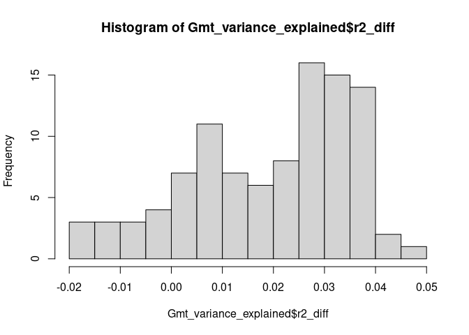
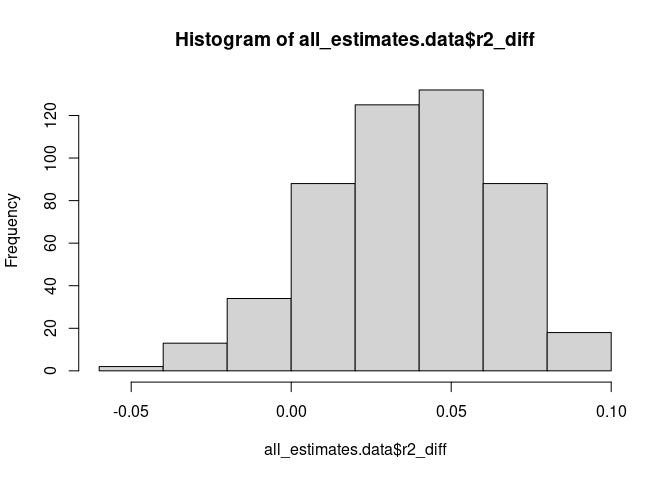

<!-- README.md is generated from README.Rmd. Please edit that file -->

# omicsR2

<!-- badges: start -->
<!-- badges: end -->

R package to investigate how much variance of a given trait is explained
by the joined effects of different omics (e.g. Methylome), centered
around the `greml` function described in the `qgg` R package

omicsR2 fits a GREML model in which one or more omics are defined as
random effects and uses cross-validation to estimate explained variance.

1.  The first step is to compute a similarity matrix based on
    genotype/DNA methylation levels/expression levels.
2.  In a second step, the similarity matrix is then included as random
    effect predicting an outcome in a training sample (e.g. random 80%
    of sample).
3.  Based on the results of the training sample, predicted estimates
    (GBLUP) are computed in validation sample.
4.  The correlation between predicted and observed values is used to
    estimate the variance explained.
5.  Variance explained by a baseline model with covariates only is
    substracted from full model.
6.  Steps 2-5 are repeated to obtain a distribution of cross-validated
    variance explained estimates across random training/validation
    splits.

For details, see description for
[qgg::greml](https://psoerensen.github.io/qgg/articles/GBLUP_cross_validation.html)

qgg reference: Palle Duun Rohde, Izel Fourie Sørensen, Peter Sørensen,
qgg: an R package for large-scale quantitative genetic analyses,
Bioinformatics, Volume 36, Issue 8, 15 April 2020, Pages 2614–2615,
<https://doi.org/10.1093/bioinformatics/btz955>

See also our [paper](https://doi.org/10.1186/s13148-022-01268-w) in
Clinical Epigenetics to see omicsR2 applied to estimate the
epigenome-wide variance explained in childhood outcomes.

Neumann, A., Pingault, JB., Felix, J.F. et al. Epigenome-wide
contributions to individual differences in childhood phenotypes: a GREML
approach. Clin Epigenet 14, 53 (2022).
<https://doi.org/10.1186/s13148-022-01268-w>

## Installation

``` r
library(devtools)
install_github("aneumann-science/omicsR2")
```

## Example

Below you find an example analysis with simulated data. In this example
we aim to estimate the variance explained in an outcome by DNA
methylation beyond the variance explained by covariates.

``` r
# Load BGData for similarity matrix computation
library(BGData)
#> Loading required package: BEDMatrix
#> Loading required package: LinkedMatrix
#> Loading required package: symDMatrix
#> 
#> Attaching package: 'BGData'
#> The following object is masked from 'package:graphics':
#> 
#>     segments

# Load omicsR2 package for GREML analysis
library(omicsR2)

# Load methylation and phenotype data
data("cpg_simulated") # Methylation data
data("phenotype") # Simulated phenotypes data
data("Batch")     # Batch similarity matrix

# The methylation data contains methylation levels
# for 1000 CpG probes (columns)
# and 500 participants (rows)
cpg_simulated[1:5,1:5]
#>             cg25196575 cg19821527 cg01981733 cg15892664 cg03899510
#> 8726_R01C01  0.6895480  0.7304246  0.7277489 0.04561352  0.5534172
#> 7253_R01C01  0.6341829  0.7699279  0.7696126 0.02072164  0.5001960
#> 4314_R01C01  0.6840574  0.6485713  0.7235824 0.06225707  0.4658770
#> 4918_R01C01  0.6602166  0.7153202  0.7593984 0.03995069  0.4248732
#> 6378_R01C01  0.6700074  0.7419636  0.8864958 0.04585153  0.4919506

# The phenotype data contains simulated outcome data and two covariates
head(phenotype, 5)
#>            ID  covariate1 covariate2      outcome
#> 1 8726_R01C01 -0.68316094 -1.7637415 -0.513053436
#> 2 7253_R01C01 -2.41439753 -0.3591278 -1.436933052
#> 3 4314_R01C01  0.16419102 -0.5285638 -1.147356719
#> 4 4918_R01C01 -0.09661301  0.6600207 -0.004951858
#> 5 6378_R01C01  0.94694099 -0.3809634  0.563698801

# Also a batch matrix is included, defining which participants are on the same
# batch (1)
Batch[c(1:5,100:105),c(1:5,100:105)]
#>       [,1] [,2] [,3] [,4] [,5] [,6] [,7] [,8] [,9] [,10] [,11]
#>  [1,]    1    1    1    1    1    1    0    0    0     0     0
#>  [2,]    1    1    1    1    1    1    0    0    0     0     0
#>  [3,]    1    1    1    1    1    1    0    0    0     0     0
#>  [4,]    1    1    1    1    1    1    0    0    0     0     0
#>  [5,]    1    1    1    1    1    1    0    0    0     0     0
#>  [6,]    1    1    1    1    1    1    1    1    1     1     1
#>  [7,]    0    0    0    0    0    1    1    1    1     1     1
#>  [8,]    0    0    0    0    0    1    1    1    1     1     1
#>  [9,]    0    0    0    0    0    1    1    1    1     1     1
#> [10,]    0    0    0    0    0    1    1    1    1     1     1
#> [11,]    0    0    0    0    0    1    1    1    1     1     1

# Compute similarity matrix for DNA methylation
# getG does the following:
# 1. Z-score standardizes the methylation values
# 2. Takes the product of the transpose
# 3. Scales the similarity matrix so mean diagonal is 1
Gmt <- getG(cpg_simulated)
Gmt[1:5, 1:5]
#>              8726_R01C01 7253_R01C01  4314_R01C01  4918_R01C01  6378_R01C01
#> 8726_R01C01  0.987641309  0.00374289  0.041017372  0.018384501 -0.005471139
#> 7253_R01C01  0.003742890  1.00439575 -0.015231670  0.024742515 -0.034994662
#> 4314_R01C01  0.041017372 -0.01523167  0.960676628 -0.006256572  0.005930505
#> 4918_R01C01  0.018384501  0.02474252 -0.006256572  0.927706670 -0.002266659
#> 6378_R01C01 -0.005471139 -0.03499466  0.005930505 -0.002266659  1.028888436

# Match phenotype and methylation similarity matrix by ID variable,
# so that participants appear in the same order
matched.list <- match_pheno_similarity(phenotype, Gmt, "ID")
#> [1] "phenotype and similarity matrix successfully matched :)"

# Save the data as separate objects again
phenotype_matched <- matched.list[[1]]
Gmt_matched <- matched.list[[2]]

# Regress outcome on methylation similarity matrix, batch similarity matrix,
# two fixed effect covariates with GREML and Monte-Carlo Cross-Validation.
# Returns variance explained by DNA methylation minus the variance explained by
# fixed effect covariates and similarity matrices specified in random_baseline.
# Training:validation ratio is 80:20 and randomly sampled 100 times.
Gmt_variance_explained <- omicsR2(outcome = "outcome",
                                  fixed_covar = "covariate1 + covariate2",
 random_full = list(Methylation=Gmt_matched, Batch=Batch),
  random_baseline = list(Batch=Batch),
 data = phenotype_matched,
 validation_proportion = 0.2, repetitions = 100, seed = 20190405)

# Examine the variance explained distribution obtained from cross-validation
head(Gmt_variance_explained$r2_diff)
#> [1]  0.007 -0.007  0.030  0.037  0.035  0.024
mean(Gmt_variance_explained$r2_diff)
#> [1] 0.01966
quantile(Gmt_variance_explained$r2_diff)
#>       0%      25%      50%      75%     100% 
#> -0.02000  0.00875  0.02400  0.03200  0.04800
hist(Gmt_variance_explained$r2_diff, breaks = 10)
```



``` r
# Multiple Imputation
# Code adapted from semTools runMI documentation

# Randomly set covariates to missing
set.seed(20190405)
phenotype_matched_na <- phenotype_matched
phenotype_matched_na$covariate1 <- ifelse(phenotype_matched_na$covariate1 <= quantile(phenotype_matched_na$covariate1, .3), NA, phenotype_matched_na$covariate1)
phenotype_matched_na$covariate2 <- ifelse(phenotype_matched_na$covariate2 <= quantile(phenotype_matched_na$covariate2, .3), NA, phenotype_matched_na$covariate2)

# Impute data five times
library(mice)
#> 
#> Attaching package: 'mice'
#> The following object is masked from 'package:stats':
#> 
#>     filter
#> The following objects are masked from 'package:base':
#> 
#>     cbind, rbind
miceImps <- mice(phenotype_matched_na)
#> 
#>  iter imp variable
#>   1   1  covariate1  covariate2
#>   1   2  covariate1  covariate2
#>   1   3  covariate1  covariate2
#>   1   4  covariate1  covariate2
#>   1   5  covariate1  covariate2
#>   2   1  covariate1  covariate2
#>   2   2  covariate1  covariate2
#>   2   3  covariate1  covariate2
#>   2   4  covariate1  covariate2
#>   2   5  covariate1  covariate2
#>   3   1  covariate1  covariate2
#>   3   2  covariate1  covariate2
#>   3   3  covariate1  covariate2
#>   3   4  covariate1  covariate2
#>   3   5  covariate1  covariate2
#>   4   1  covariate1  covariate2
#>   4   2  covariate1  covariate2
#>   4   3  covariate1  covariate2
#>   4   4  covariate1  covariate2
#>   4   5  covariate1  covariate2
#>   5   1  covariate1  covariate2
#>   5   2  covariate1  covariate2
#>   5   3  covariate1  covariate2
#>   5   4  covariate1  covariate2
#>   5   5  covariate1  covariate2
#> Warning: Number of logged events: 1

# Create a list of imputed datasets
impList <- list()
for (i in 1:miceImps$m) impList[[i]] <- complete(miceImps, action = i)

# Repeat GREML analysis, but this time on multiply imputed data
Gmt_variance_explained_imp <- omicsR2_imp(outcome = "outcome",
                                      fixed_covar = "covariate1 + covariate2",
                                      random_full = list(Methylation=Gmt_matched, Batch=Batch),
                                      random_baseline = list(Batch=Batch),
                                      imp_list = impList,
                                      validation_proportion = 0.2, repetitions = 100, seed = 20190405)

# Examine the variance explained distribution across cross-validations and
# imputed datasets
all_estimates.data <- do.call(rbind, Gmt_variance_explained_imp[[1]])
hist(all_estimates.data$r2_diff, breaks = 10)
```



``` r
Gmt_variance_explained_imp[[3]]
#>   r2_covariates_mean_pooled r2_covariates_total_sd r2_full_mean_pooled
#> 1                  0.333768             0.07429708            0.370664
#>   r2_full_total_sd r2_diff_mean_pooled r2_diff_total_sd
#> 1       0.07364816            0.036896       0.02718053
```
